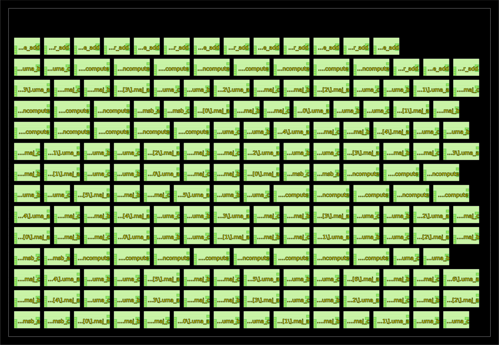

   

# TinyTapeout 4/8 reversible-gate MAC

- [Read the documentation for project](docs/info.md)

**Prepared for development and submission review, not cleared for fabrication.**
The top signal interface is unchanged; the module is `tt_um_bhagwat_rahul_reversible_mac`.
Operands are `ui_in[3:0]` / `ui_in[7:4]`, valid/reverse are `uio_in[0]` /
`uio_in[1]`, and `uo_out` is the 8-bit accumulator. All bidirectional pins are
inputs. Reset is synchronous, and arithmetic wraps modulo 256.

## Included files

- `src/project.v`, `src/reversible_mac.v`: wired 4-bit/8-bit implementation.
- `src/reversible_stdcells/`: all three Xschem schematics, symbols and benches,
  characterization scripts/CSVs, KLayout layout generator/router, GDS/OAS/LEF,
  extraction and verification reports, Verilog models and layout screenshots.
- `src/tests/`: standalone MAC arithmetic/cleanup/synthesis regression.
- `test/`: cocotb tests through the TinyTapeout pins.
- `src/config.json`: LibreLane custom macro views, synthesis blackboxes and
  VPWR/VGND-to-VDD/VGND macro power-net hooks. No signal pins were added.

Copied cell collateral comes from the local `reversible-circuit` workspace,
including its uncommitted MAC implementation—not a remote branch. Archived
reports may contain original absolute paths. Use the Python entry points to
regenerate them here; do not run archived generated Tcl scripts directly.
The copied cell READMEs contain the original workspace's examples; use the
paths below for this repository. No sibling repository is needed to build RTL.

## Local checks in IIC-OSIC-TOOLS

```sh
docker exec -it -w /foss/designs/current-designs/reversible-mac \
  iic-osic-tools_xserver_uid_501 bash -i
iic-pdk sky130A
make -C test
python3 src/tests/check_reversible_mac.py
# To recheck the copied physical cells (not the assembled MAC):
python3 src/reversible_stdcells/layout/validate.py
```

Always run `iic-pdk sky130A` in each new container shell. For Xschem, use
`xschem --rcfile "$PWD/src/reversible_stdcells/xschemrc"` followed by a cell or
testbench schematic path. `info.yaml` lists only project RTL; LibreLane obtains
the cell declarations from `EXTRA_VERILOG_MODELS`. The cocotb Makefile instead
loads the zero-delay Boolean models, including for eventual gate-level tests.
Never substitute those simulation models into physical synthesis. The optional
FPGA workflow is not configured to replace these ASIC blackboxes.

## Macro placement

`src/macro_placement.cfg` supplies all 188 synthesized instance coordinates;
`MACRO_PLACEMENT_CFG` in `src/config.json` loads it automatically. No manual
coordinate entry is needed in the GitHub action. This is a fixed floorplan for
the current 4/8 implementation, not an automatic placer for arbitrary widths.

The 112 CNOT and 76 Toffoli macros occupy 15 rows, all orientation N, with
1.38 µm horizontal and 1.36 µm vertical channels. Bounds are x = 4.60–144.90 µm
and y = 5.44–106.08 µm, inside the TTSKY26c 161 × 111.52 µm tile. The right
~11.5 µm is a continuous stdcell/PDN street so TinyTapeout’s met1-only rails
are not cut by a full-width empty band (OpenROAD PDN-0178). Standard-cell
exclusion halos are 0.46 µm horizontally and 0.68 µm vertically.

Local LibreLane verification in IIC-OSIC-TOOLS completed through
`OpenROAD.CutRows`. The resulting ODB confirms all 188 macros are fixed, match
the coordinates, lie inside the core without overlap, and have logical
VDD/VGND connections to VPWR/VGND. Row cutting leaves 1,680.36 µm² of sites for
ordinary cells (521.75 µm² immediately after synthesis, before added physical
cells/buffers). Physical power routing has **not** been verified.



After changing hierarchy, parameters, or cell dimensions, regenerate from the
new flattened synthesis JSON and rerun floorplanning:

```sh
python3 scripts/place_macros.py src/runs/<run>/06-yosys-synthesis/*.nl.v.json
python3 scripts/place_macros.py --check src/runs/<run>/06-yosys-synthesis/*.nl.v.json
```

The generator intentionally rejects gate counts other than this 4/8 design.

## Remaining submission blockers

- **Routed fit is unproven:** macro placement fits, but the 112 CNOT + 76
  Toffoli macros alone occupy 9,799.40 µm².
  Local SKY130 synthesis adds about 521.75 µm² of ordinary cells, before physical
  buffering, macro spacing, PDN and routing. Synthesis's reported area alone
  excludes the blackboxes and must not be mistaken for total area.
- **Timing is unqualified:** custom cells lack characterized Liberty timing
  arcs. Their functional-only Liberty is copied for reference, but deliberately
  not loaded by the production config. 100 kHz/10,000 ns is only a bring-up
  target, not timing closure. A green flow with blackboxed STA is insufficient.
- **Physical integration is unfinished:** validate power
  access to their small M3 pins, route the design, and run full chip-level
  DRC/LVS/antenna/density checks plus TinyTapeout precheck. PDN hooks name the
  nets; they do not themselves build a working physical supply network.
- **LVS must handle wire aliases:** A_OUT/B_OUT are physical shorts to their
  inputs, not independent buffers. Cell-level validation normalizes those
  aliases; the final assembled design needs equivalent correct treatment.

The template workflows remain enabled; no failing checks have been disabled
to imply tapeout readiness. Nothing has been pushed or submitted.

## What is Tiny Tapeout?

Tiny Tapeout is an educational project that aims to make it easier and cheaper than ever to get your digital and analog designs manufactured on a real chip.

To learn more and get started, visit https://tinytapeout.com.

The GitHub action will automatically build the ASIC files using [LibreLane](https://www.zerotoasiccourse.com/terminology/librelane/).

## Enable GitHub actions to build the results page

- [Enabling GitHub Pages](https://tinytapeout.com/faq/#my-github-action-is-failing-on-the-pages-part)

## Resources

- [FAQ](https://tinytapeout.com/faq/)
- [Digital design lessons](https://tinytapeout.com/digital_design/)
- [Learn how semiconductors work](https://tinytapeout.com/siliwiz/)
- [Join the community](https://tinytapeout.com/discord)
- [Build your design locally](https://www.tinytapeout.com/guides/local-hardening/)

## What next?

- [Submit your design to the next shuttle](https://app.tinytapeout.com/).
- Edit [this README](README.md) and explain your design, how it works, and how to test it.
- Share your project on your social network of choice:
  - LinkedIn [#tinytapeout](https://www.linkedin.com/search/results/content/?keywords=%23tinytapeout) [@TinyTapeout](https://www.linkedin.com/company/100708654/)
  - Mastodon [#tinytapeout](https://chaos.social/tags/tinytapeout) [@matthewvenn](https://chaos.social/@matthewvenn)
  - X (formerly Twitter) [#tinytapeout](https://twitter.com/hashtag/tinytapeout) [@tinytapeout](https://twitter.com/tinytapeout)
  - Bluesky [@tinytapeout.com](https://bsky.app/profile/tinytapeout.com)
